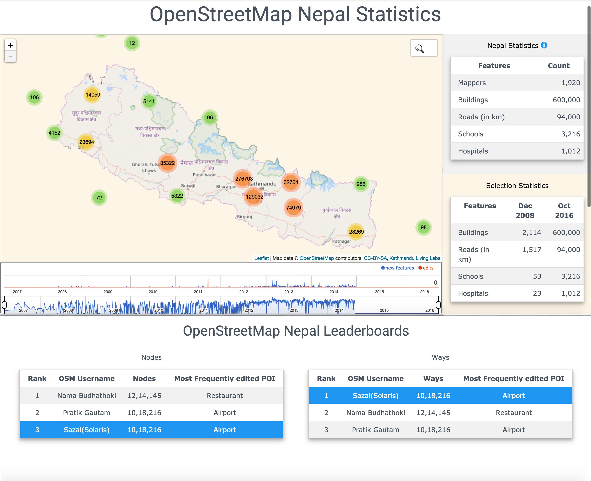

#Readme for Nepal OSM History Visualizer

The **Nepal OSM History Visualizer** is a project by Kathmandu Living Labs and the Dartmouth Dickey Center.  It was built by Sazal and Max, and designed by Paras and Sazal.



This project is an attempt to replicate the features of the [OpenStreetMaps Analytics Tool](http://osm-analytics.org) (OSMA).  The primary difference is that we are incorporating full edit history, meaning that our database and our metadata (charts, graphs, statistics, etc.) take into account every single edit ever done to every single feature, even if that edit is not currently visible.  OSMA does not do this, and they acknowledge it as a major limitation in their [README](https://github.com/hotosm/osm-analytics).

#TODO

1. Google Charts is too slow right now.  It either needs to be optimized for at minimum 50% speed increase, or replaced with an alternative such as [D3.JS](http://bl.ocks.org/mbostock/34f08d5e11952a80609169b7917d4172) (I can't get this to not look like garbage when squeezed to be less tall, maybe worth giving another shot later on) or [Dygraphs](http://dygraphs.com/tests/range-selector.html) (see [article relating to Dygraphs and R](https://rstudio.github.io/dygraphs/gallery-range-selector.html)).
2. `cards.js` needs to send queries to GeoDjango server per Sazal's API, get the response, and update accordingly per user selections.
2. `fillmap.js` needs user and place search.


#Prerequisites/Dependencies

* GIT Submodules:
	* [Salsify's PHP JSON Streamer](https://github.com/salsify/jsonstreamingparser)
		* MAMP or XAMPP
		* php > 5.4
		* composer for php 
			* [instructions for Windows - php & Composer](http://i.justrealized.com/2013/install-composer-windows/)	
	* [PruneCluster](https://github.com/SINTEF-9012/PruneCluster)
	
Remember to [initialize and pull the submodules](http://stackoverflow.com/questions/1030169/easy-way-pull-latest-of-all-submodules), too.  Also, you need to initialize composer, and require the json streamer.

The following list of commands should (hopefully) work:

```bash
# go to the path in your MAMP/XAMPP/etc server where you plan to host the project
cd /path/to/your/server/htdoc
# clone the project
git clone https://github.com/maxvonhippel/NepalOSMHistory.git
cd NepalOSMHistory
# clone the submodules
git submodule update --init --recursive
# set up composer
cd server
# install composer - this part is a bit more tricky - see:
# https://getcomposer.org/doc/00-intro.md#installation-linux-unix-osx
php composer-setup.php --install-dir=bin --filename=composer
mv composer.phar /usr/local/bin/composer
composer
# ok, composer is installed, let's set up composer for our project
composer init
# just press return until it finishes, but say no to the bit about requiring stuff
composer require salsify/json-streaming-parser:dev-master
composer update
cd plugins/phpjson
composer update
```

#Data

You need to make a GeoJSON file with some data in Nepal and name it **dirtydate.json**, and put it in the **server/data** folder in the repository.  

(Or name it whatever you want, use data from wherever you want, and modify [fillmap.js](https://github.com/maxvonhippel/NepalOSMHistory/blob/master/js/fillmap.js) accordingly.  It's not a complex script, you can easily modify it to fit your needs.)  

If you'd like to get started with the repo immediately, you just need to make a **dirtydate.json** file that looks like this:

```GEOJSON
{
	"type":"FeatureCollection",
	"features":[
		{
			"type":"Feature",
			"geometry":{
				"type":"Point",
				"coordinates":[85.3019553,27.7257842]
			},
			"properties":{
				"feature_id":31303849,
				"id":4627,
				"version":1,
				"uid":"7094",
				"user":"Eratosthenes",
				"timestamp":"2007-07-05T01:42:23+05:45"
			}
		}
	]
}

```
This is in accordance with the GeoJSON [spec](http://geojson.org/geojson-spec.html).  Note that your GeoJSON absolutely *does not* have to be pretty.  In fact, the file we use (which is generated in GeoDjango/PostGIS) looks like this:

```GEOJSON
{"type":"FeatureCollection","features":[{"type":"Feature","geometry":{"type":"Point","coordinates":[85.3019553,27.7257842]}, etc

```
Using an ugly GeoJSON file significantly reduces file size.

#Other Important Stuff To Know

You can reach Max on Twitter [`@_m_vh`](https://twitter.com/_m_vh), or Kathmandu Living Labs [`@KTMLivingLabs`](https://twitter.com/KTMLivingLabs).  We accept and welcome pull requests!  But regardless, feel free to fork.  **MIT License with Attribution.**

Head on over to the [Wiki](https://github.com/maxvonhippel/NepalOSMHistory/wiki) for more information!  It's definitely a work in progress, but there should be more details there to illuminate anything not made immediately clear in the README.  And if something is missing, let us know!

We are working on documenting our server setup in the Wiki.  We have a PostGIS GeoDjango database with full history data that responds to queries and outputs json, and we explain how to build and use it in the Wiki.